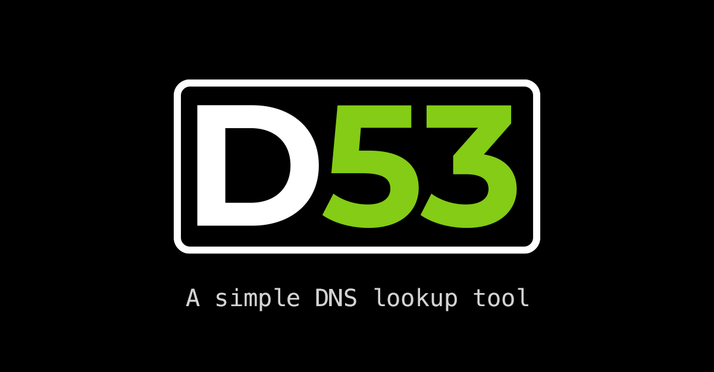

D53 is a web based DNS lookup tool built on Ruby on Rails.
Its purpose is to offer a user friendly version of the `dig`
command, but with an intuitive and visually pleasing interface.

**Key Features**
- Remembers the last record type you queried.
- Keeps a log of your recent queries in the browser session.
- Allows you to query from a list of top DNS providers.
- Has PWA support so you can install on mobile and have a semi-native experience.
